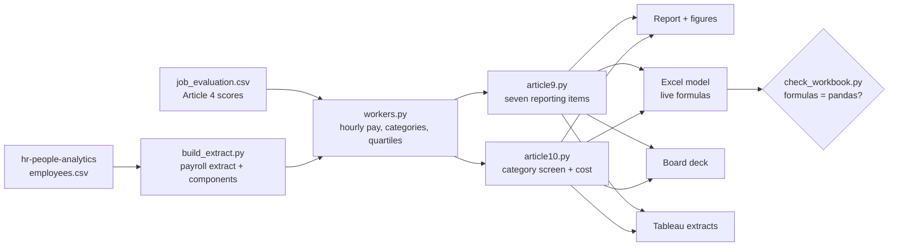

# Pay Transparency Readiness Kit

The EU Pay Transparency Directive makes employers with 250 or more workers publish their gender
pay gap every year from **7 June 2027**, and makes them justify, fix or jointly assess any gap of
5% or more between women and men doing work of equal value. This kit runs that exercise on a
four-country employer, end to end, **as a consulting team would deliver it**: a live Excel model,
a board briefing, a written read-out and a readiness checklist, all produced by one reproducible
pipeline and reconciled figure by figure.

[](https://github.com/D0M3N1C0X/pay-transparency-readiness-kit/actions/workflows/ci.yml)


> **Synthetic data, not legal advice.** The organisation is the one analysed in
> [hr-people-analytics](https://github.com/D0M3N1C0X/hr-people-analytics); the pay components and
> one discriminatory mechanism were added here and are
> [declared openly](data/README.md#what-is-planted-stated-openly). Legal status as of
> 16 September 2026, with every source in the [verification register](docs/verification.md).

### ▶ [Read the report online](https://d0m3n1c0x.github.io/pay-transparency-readiness-kit/) · [Board briefing (PDF)](https://d0m3n1c0x.github.io/pay-transparency-readiness-kit/board_briefing.pdf) · [Download the Excel model](https://github.com/D0M3N1C0X/pay-transparency-readiness-kit/raw/main/deliverables/pay_transparency_model.xlsx)

---

## The answer, for the board

| | |
|---|---|
| **All four employers report every year from 7 June 2027.** Italy has transposed the Directive (D.Lgs. 96/2026); Poland only in part; Germany and Spain not yet. | **The hourly gender pay gap is 17.6%** across the group, from 14.5% in Munich to 21.5% in Barcelona. |
| **Base pay alone gives 15.4%** - the same figure hr-people-analytics found. Bonus, commission and allowances add 2.2 points. | **12 of 28 categories of workers** are at 5% or more: each needs a gender-neutral justification or a remedy by **7 December 2027**, or a joint pay assessment follows. |
| In Sales, commission is **12.6% of base pay for women and 15.1% for men** under identical rules: territories are allocated unequally. | Closing every flagged gap outright would cost **at most €1.9 million a year**. Of 14 obligations, **1 is in place, 6 partly, 7 missing**. |



---

## What you get

| Deliverable | For | What is in it |
|---|---|---|
| [`pay_transparency_model.xlsx`](deliverables/pay_transparency_model.xlsx) | the client team | Ten sheets: summary, the seven Article 9 items per employer, the Article 10 screen with space for justifications, obligations and deadlines, readiness checklist, job evaluation, payroll, settings, and a reconciliation sheet. **Every figure is a live formula**: change a salary, a score or a threshold and the model recalculates. |
| [`board_briefing.pptx`](deliverables/board_briefing.pptx) | the board | Ten slides, answer first, native charts, three decisions to take. |
| [`readiness_report.md`](reports/readiness_report.md) | HR and Legal | The written read-out: obligations, the seven items, where the gap comes from, flagged categories with their main driver and cost, a 90-day plan. |
| [`tableau/`](tableau/) | a live dashboard | Tidy extracts and a build sheet for Tableau Public. |
| [`docs/method.md`](docs/method.md) · [`docs/verification.md`](docs/verification.md) | reviewers | Every choice the Directive leaves open, and the source and status of every legal statement. |

## What this project demonstrates

| Employment law and HR | Analytics | Consulting delivery and engineering |
|---|---|---|
| Directive (EU) 2023/970 read article by article: Articles 3, 4, 5-7, 9, 10, 12 and 18 | Mean and median gaps on hourly and annual pay, component gaps among recipients, quartile pay bands with explicit tie-breaking | A client-ready Excel model: inputs in blue, formulas in black, assumptions in one Settings sheet, no hard-coded results |
| Gender-neutral job evaluation on skills, effort, responsibility and working conditions, with a rationale for every score | Categories of equal value that cross departments, and a screen that flags gaps in either direction | A board deck that leads with the answer and ends with decisions |
| National transposition tracked for Italy, Poland, Germany and Spain, including the Italian collective-agreement presumption | A remediation cost ceiling per category - the finance question every board asks | **Two engines, one answer:** pandas and Excel formulas reconciled on 460 checks, recalculated in CI by LibreOffice |
| Disclosure control for small categories (Article 12(3)) | A planted, indirect mechanism the screen has to find | Deterministic outputs, a test suite, and a verification register for every legal claim |

## How it fits together



## Run it

```bash
python3 -m venv .venv && . .venv/bin/activate
pip install -r requirements.txt
python src/run_all.py        # about 15 seconds
```

Tests, including a sample workbook recalculated in pure Python and checked against pandas:

```bash
pip install -r requirements-dev.txt
pytest
```

The full workbook is recalculated by LibreOffice in CI:

```bash
python src/recalc_libreoffice.py deliverables/pay_transparency_model.xlsx build/
python src/check_workbook.py build/pay_transparency_model.xlsx
```

## What's inside

```
├── data/
│   ├── source/employees.csv     the organisation from hr-people-analytics (checksum pinned)
│   ├── payroll_extract.csv      3,443 workers with four pay components
│   ├── job_evaluation.csv       36 roles scored on the Article 4(4) criteria
│   ├── transposition.csv        national status, with sources
│   └── readiness_checklist.csv  14 obligations from Articles 4 to 12
├── src/
│   ├── config.py                every assumption in one place
│   ├── build_extract.py         the payroll extract (standard library, byte-stable)
│   ├── workers.py               hourly pay, categories, quartile bands
│   ├── article9.py              the seven reporting items
│   ├── article10.py             category gaps, the 5% screen, remediation cost
│   ├── obligations.py           size bands, deadlines, readiness
│   ├── build_workbook.py        the Excel model and its reconciliation sheet
│   ├── check_workbook.py        proves the formulas reproduce pandas
│   ├── recalc_libreoffice.py    recalculates the workbook headless, for CI
│   ├── build_deck.py            the board briefing
│   ├── build_report.py          the written read-out and its figures
│   ├── charts.py                three SVG charts, validated palette, light and dark
│   ├── build_tableau.py         extracts for Tableau Public
│   └── run_all.py               the whole pipeline
├── deliverables/                the workbook and the deck
├── reports/                     the read-out, its HTML page and figures
├── tableau/                     extracts and the dashboard build sheet
├── docs/                        method and verification register
└── tests/
```

## Choices worth knowing

- **Pay** is base plus bonus, commission, shift and car allowances; **hourly pay** divides by
  contractual hours. Items (a) and (c) are reported on hourly and annual pay, because the
  Directive defines pay level as both.
- **Component gaps (b) and (d) are computed among recipients**; item (e) says how many receive one.
- **A category is flagged** at a 5% difference in either direction, on hourly or annual pay.
- **Categories come from job evaluation.** In Italy they should start from the collective
  agreement, which D.Lgs. 96/2026 presumes compliant.
- **This is a dry run** on a 30 June 2026 snapshot; the statutory report covers pay in the
  previous calendar year.

Full reasoning in [docs/method.md](docs/method.md).

## About

Built by **Domenico Perroni** - HR advisory, people analytics and media education, based in Kraków.
[GitHub profile](https://github.com/D0M3N1C0X) · [LinkedIn](https://www.linkedin.com/in/domenico-perroni)

**More from the same portfolio**

- [hr-people-analytics](https://github.com/D0M3N1C0X/hr-people-analytics) - attrition drivers, EU pay-transparency exposure and HR service-desk performance on a synthetic 4,000-employee organisation, with the [report online](https://d0m3n1c0x.github.io/hr-people-analytics/)
- [engagement-survey-analytics](https://github.com/D0M3N1C0X/engagement-survey-analytics) - an employee engagement survey analysed end to end, with a [live dashboard](https://d0m3n1c0x.github.io/engagement-survey-analytics/) you can filter in the browser
- [job-search-agent](https://github.com/D0M3N1C0X/job-search-agent) - a job search run as a pipeline: public ATS board APIs, explainable fit scoring, funnel analytics
- [pompei-stratificata](https://github.com/D0M3N1C0X/pompei-stratificata) - Pompeii and Herculaneum from AD 79 to today, a [walkable model](https://d0m3n1c0x.github.io/pompei-stratificata/) with a sourced documentary dossier, in six languages

MIT licensed. Reuse anything here.
